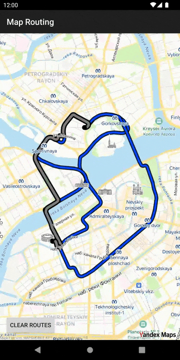
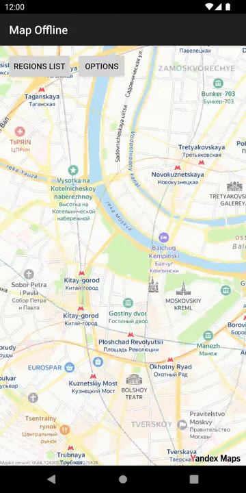

# Yandex MapKit Demo Apps

Yandex MapKit is a cross-platform library that lets you use the capabilities of Yandex Maps in mobile applications for iOS and Android. Learn more about the MapKit SDK on the [documentation](https://yandex.ru/dev/mapkit/doc/en/?from=github-demo) page.

Visit the [Getting started](https://yandex.ru/dev/mapkit/doc/en/android/generated/getting_started) page for quick start development with the MapKit SDK.

The current repository contains sample code for how to use the MapKit SDK for Android applications.

## Project structures

There are two Android projects in the repository:

1. [__`mapkit-samples`__](mapkit-samples): Contains several Android applications with sample code in Kotlin, all of which are demonstrated in the MapKit SDK Tutorials documentation.

    - [`map-with-placemark`](mapkit-samples/map-with-placemark): A simple MapKit SDK application with [Getting started with MapKit for Android](https://yandex.ru/dev/mapkit/doc/en/android/generated/getting_started) information.

    - [`map-objects`](mapkit-samples/map-objects): Using the [Map Objects](https://yandex.ru/dev/mapkit/doc/en/android/generated/tutorials/map_objects) API to add objects to the map.

    - [`map-interaction`](mapkit-samples/map-interaction): Examples from the [Map Interaction](https://yandex.ru/dev/mapkit/doc/en/android/generated/tutorials/map_interaction) tutorial.

    - [`map-search`](mapkit-samples/map-search): Examples of how to use the [Search](https://yandex.ru/dev/mapkit/doc/en/android/generated/tutorials/map_search) and [Geosuggest](https://yandex.ru/dev/mapkit/doc/en/android/generated/tutorials/map_suggest) functionality.

    - [`map-routing`](mapkit-samples/map-routing): About the [Routes](https://yandex.ru/dev/mapkit/doc/en/android/generated/tutorials/map_routes) and [Routing](https://yandex.ru/dev/mapkit/doc/en/android/generated/tutorials/map_routing) API.

    - [`map-offline`](mapkit-samples/map-offline): Examples of using the [Offline Maps](https://yandex.ru/dev/mapkit/doc/en/android/generated/tutorials/map_offline) API for working with MapKit's maps without the internet.

2. [__`mapkit-demo`__](mapkit-demo): A demo application in Java that contains the basic functionality of the lite and full MapKit SDK versions. It is not supported with Tutorials documentation, unlike the `mapkit-samples` project.

## Build locally

1. Clone the repository: 
    ```sh
    git clone https://github.com/yandex/mapkit-android-demo.git
    ```

2. Demo applications use the MapKit SDK, which requires __API key__. You can get a free MapKit __API key__ in the [Get the MapKit API Key](https://yandex.ru/dev/mapkit/doc/en/android/generated/getting_started#key) documentation.
 
3. Depending on the project you want to build, follow the steps in the following sections.

### mapkit-samples

1. Open or create the __project's__ `local.properties` file. Add the following property with your __API key__ value in place of the `YOUR_API_KEY` placeholder:
    
    ```properties
    MAPKIT_API_KEY=YOUR_API_KEY
    ```

2. Choose a target in Android Studio for build, or use a CLI build with gradle wrapper:
    
    ```sh
    ./gradlew :map-with-placemark:assembleRelease
    ```

### mapkit-demo

1. Open the [`MainApplication.java`](mapkit-demo/src/main/java/com/yandex/mapkitdemo/MainApplication.java) and edit the `MAPKIT_API_KEY` field, setting its value with your __API key__ in place of the `your_api_key` placeholder:
    
    ```java
    private final String MAPKIT_API_KEY = "your_api_key";
    ```

2. Run the __mapkit-demo__ target in Android Studio or use the CLI build with gradle wrapper:

    ```sh
    ./gradlew assembleLiteRelease  # Lite MapKit samples only
    ./gradlew assembleFullRelease  # Lite and full 
    ```

## Support

If you have problems or suggestions while using MapKit, visit the [contact](https://yandex.ru/dev/mapkit/doc/en/feedback/) page.

## Sample overview

| [map-with-placemark](mapkit-samples/map-with-placemark) <br>Demonstrates how to create a MapKit map, move<br>it, and display custom tappable placemarks. | [map-objects](mapkit-samples/map-objects) <br>How to display different objects on the map, including:<br>images, geometries, and clusterized collections. |
|:-|:-|
|  |  | 

| [map-interaction](mapkit-samples/map-interaction)<br> About interacting with the MapKit map using <br>camera movements, tap actions, focus rect <br> and focus point, and interactions with POIs. | [map-search](mapkit-samples/map-search) <br>Shows how to use Search and Geosuggest <br>functionality in the full MapKit SDK. |
|:-|:-|
|  |  |

| [map-routing](mapkit-samples/map-routing)<br> Building routes using requested map points. | [map-offline](mapkit-samples/map-offline) <br> How to download offline maps to use<br> them without the internet. |
|:-|:-|
|  |  |
